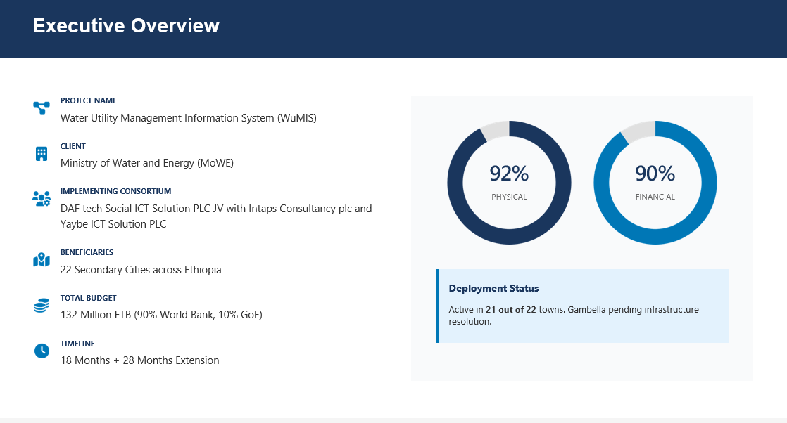
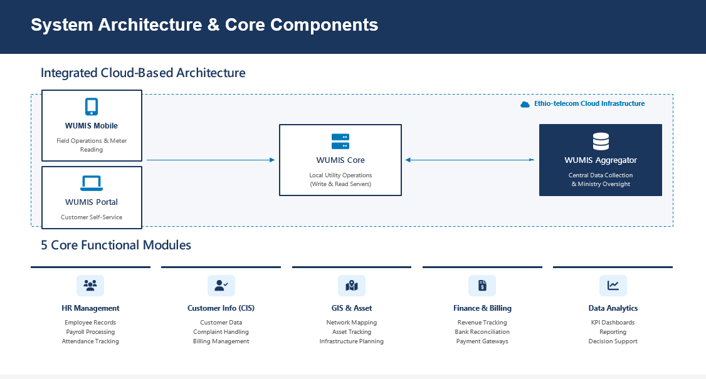
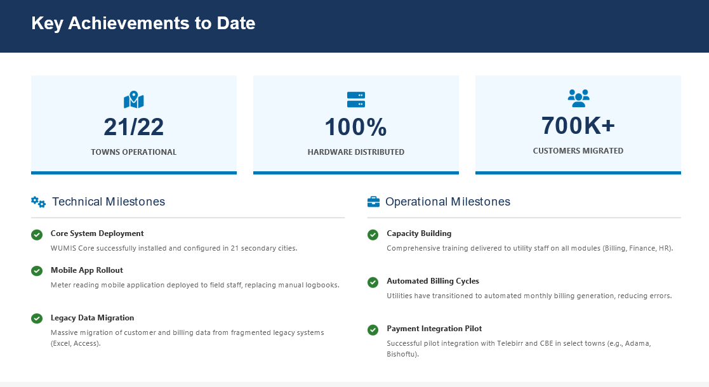
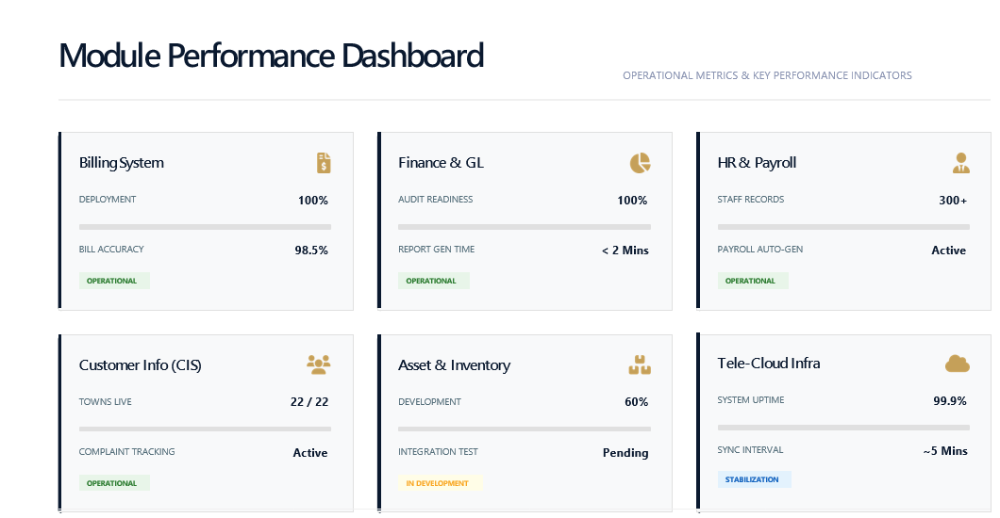
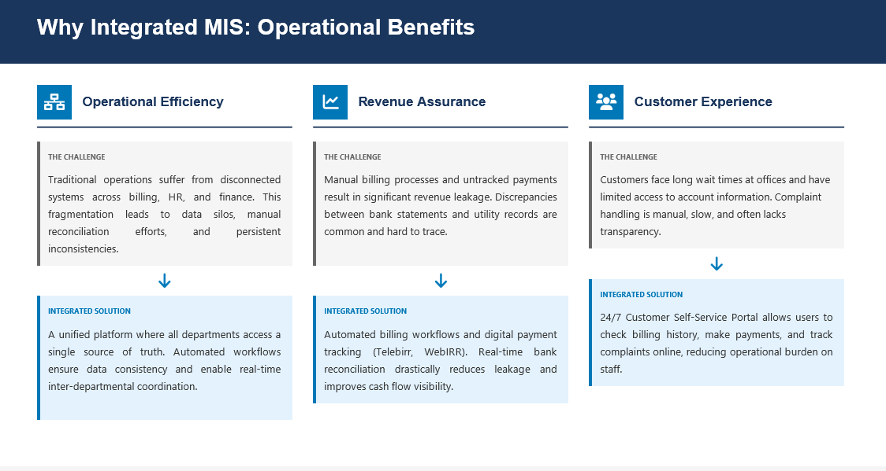

# Urban Water Utility MIS Portfolio

## Overview

This repository presents my professional portfolio supporting the implementation, monitoring, testing, training, and reporting of the Integrated Water Utility Management Information System (WuMIS) under the Ministry of Water and Energy (MoWE), Ethiopia.

The project was implemented in 22 secondary cities under the Urban Water Supply and Sanitation Program (UWSSP).

---

## Project Overview



### Key Information

| Item | Description |
|--------|-------------|
| Project | Water Utility Management Information System (WuMIS) |
| Client | Ministry of Water and Energy (MoWE) |
| Coverage | 22 Secondary Cities |
| Budget | 132 Million ETB |
| Platform | Cloud-Based Utility Management System |
| Role | MIS Consultant |

---

## System Architecture



The system integrates:

- WuMIS Mobile Application
- Customer Self-Service Portal
- Core Utility Operations Platform
- Central Data Aggregator
- Telecom Cloud Infrastructure

---

## Functional Modules

### Customer Information System (CIS)

- Customer registration
- Customer account management
- Complaint handling
- Service requests

### Billing and Revenue Management

- Automated billing
- Payment processing
- Revenue tracking
- Account reconciliation

### Finance and Accounting

- Financial reporting
- Budget management
- General ledger management
- Audit support

### Human Resource Management

- Employee records
- Payroll processing
- Attendance management
- Staff performance monitoring

### GIS and Asset Management

- Utility network mapping
- Asset inventory
- Infrastructure planning
- Asset maintenance tracking

### Data Analytics and Reporting

- KPI dashboards
- Utility performance monitoring
- Operational reporting
- Decision support analytics

---

## Project Achievements



### Major Results

- 21 out of 22 utilities operational
- 700,000+ customer records migrated
- 100% hardware distributed
- Utility staff trained nationwide
- Legacy data successfully migrated
- Automated billing processes implemented

---

## Dashboard Monitoring



The MIS platform provides operational dashboards for:

- Billing Management
- Finance and General Ledger
- Human Resources
- Customer Information Systems
- Asset Management
- Cloud Infrastructure Monitoring

These dashboards support evidence-based decision making and utility performance monitoring.

---

## Operational Benefits



### Benefits Achieved

#### Operational Efficiency

- Reduced manual processes
- Improved inter-department coordination
- Enhanced workflow automation

#### Revenue Assurance

- Automated billing and collection
- Payment reconciliation
- Revenue leakage reduction

#### Customer Service Improvement

- Customer self-service portal
- Online complaint tracking
- Improved service delivery

---

## My Role

As an MIS Consultant, I supported:

- System implementation monitoring
- User Acceptance Testing (UAT)
- Requirements validation
- Data migration verification
- Utility performance reporting
- GIS integration support
- Stakeholder coordination
- User training support
- Progress monitoring and reporting
- Quality assurance activities

---

## Technologies and Tools

- Python
- SQL
- ArcGIS
- QGIS
- Power BI
- Microsoft Excel
- GIS and Remote Sensing
- Data Analytics
- Database Management Systems

---

## Repository Structure

```text
Urban-Water-Utility-MIS-Portfolio/
│
├── images/
├── dashboards/
├── diagrams/
├── documents/
└── README.md
```

---

## Organization

Ministry of Water and Energy (MoWE), Ethiopia

---

## Author

**Jifara Dabessa**

Water Resources Engineer | GIS Specialist | Data Analyst | MIS Consultant

### Expertise

- Integrated MIS Systems
- GIS and Remote Sensing
- Data Analytics
- Water Utility Information Systems
- Hydrological Modeling
- Groundwater Modeling
- Python Programming

---

## Disclaimer

This repository is intended to showcase professional experience and contributions to MIS implementation and utility digital transformation initiatives. Sensitive project data, source code, and confidential documents are not included.
